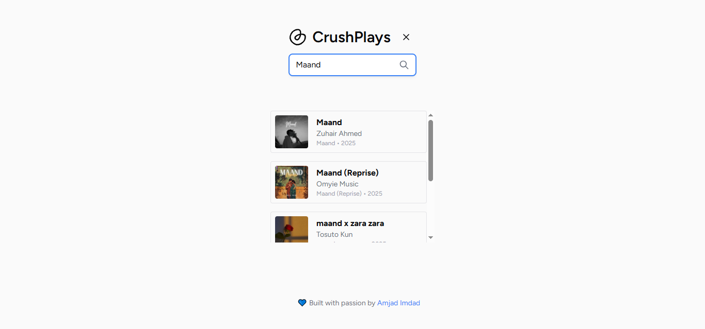

# 🎵 CrushPlays

CrushPlays is a sleek and modern music streaming web app built with Next.js, TailwindCSS, and Radix UI.
Currently powered by JioSaavn API, it lets you search for tracks in real time with a smooth, responsive, and visually appealing interface.
In the future, support for album and artist search is planned.

## ✨ Features

- 🎧 JioSaavn API Integration – Search for any track in real time (Albums and artists search coming soon!)
- 📀 Play preloaded music instantly
- 📱 Fully responsive UI for mobile, tablet, and desktop
- 🎨 Sleek and accessible UI powered by TailwindCSS + Radix UI
- 🎞️ Smooth animations with Framer Motion
- 🎡 Interactive carousels using Embla Carousel

## 🛠️ Tech Stack

**Frontend Framework:** Next.js  
**Styling:** TailwindCSS, tailwindcss-animate  
**UI Components:** Radix UI  
**Animations:** Framer Motion  
**Carousel:** Embla Carousel  
**API:** JioSaavn API  
**Icons:** Lucide React

## 📸 Screenshots

## **Home Page**

## **Search Results**

## **Now Playing**

## 📜 License

This project is licensed under the MIT License – you are free to use, modify, and distribute.

💙 Built with passion by **** (Original concept by ****)
