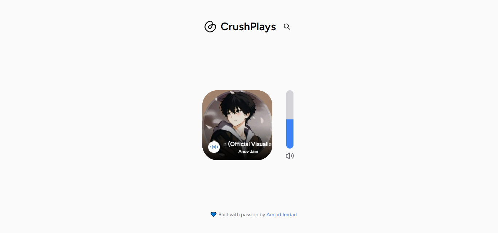
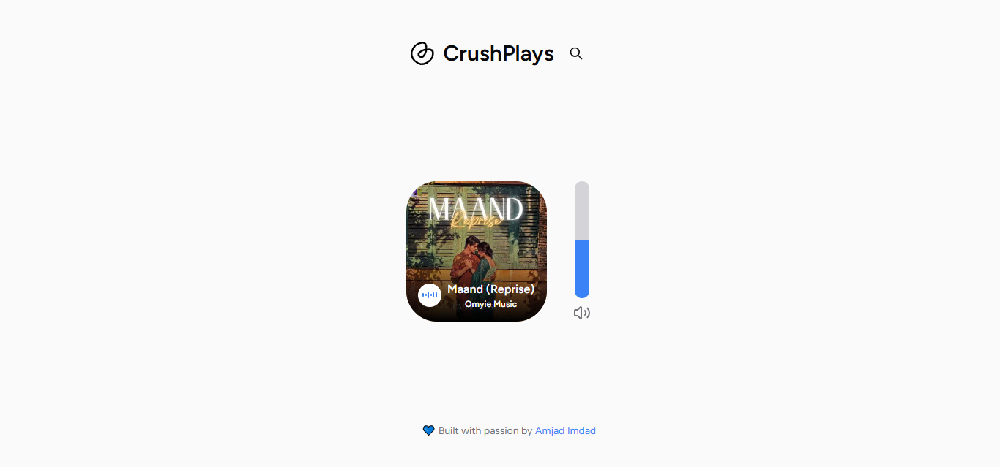

# 🎵 CrushPlays

CrushPlays is a sleek and modern music streaming web app built with **Next.js**, **TailwindCSS**, and **Radix UI**.  
Upgraded with **Spotify API integration**, it allows you to search, discover, and play millions of songs with a smooth, responsive, and visually appealing interface.

---

## ✨ Features

- 🎧 **Spotify API Integration** – Search for any track, artist, or album in real time
- 📀 Play preloaded music instantly without login
- 📱 Fully responsive UI for mobile, tablet, and desktop
- 🎨 Sleek and accessible UI powered by **TailwindCSS** + **Radix UI**
- 🎞️ Smooth animations with **Framer Motion**
- 🎡 Interactive carousels using **Embla Carousel**
- ⏳ Custom progress bars & sliders for playback controls
- 🌙 Dark & Light mode toggle using \`next-themes\`
- 🔔 Toast notifications via **Sonner**

---

## 🛠️ Tech Stack

**Frontend Framework:** Next.js  
**Styling:** TailwindCSS, tailwindcss-animate  
**UI Components:** Radix UI  
**Animations:** Framer Motion  
**Carousel:** Embla Carousel  
**API:** Spotify Web API  
**Icons:** Lucide React  
**Notifications:** Sonner

---

### 2️⃣ Install dependencies

\`\`\`bash
npm install
\`\`\`

### 3️⃣ Configure Environment Variables

Create a \`.env.local\` file in the root of your project and add:

\`\`\`env
NEXT_PUBLIC_SPOTIFY_CLIENT_ID=your_spotify_client_id
SPOTIFY_CLIENT_SECRET=your_spotify_client_secret
SPOTIFY_REFRESH_TOKEN=your_spotify_refresh_token
\`\`\`

🔹 **How to get Spotify credentials:**

1. Go to [Spotify Developer Dashboard](https://developer.spotify.com/dashboard/).
2. Create a new app and copy the **Client ID** and **Client Secret**.
3. Use a tool like [Spotify Token Generator](https://developer.spotify.com/console/get-search-item/) to generate a refresh token.

---

### 4️⃣ Run the development server

\`\`\`bash
npm run dev
\`\`\`
Visit **[http://localhost:3000](http://localhost:3000)** to see the app.

---

<!-- ## 📸 Screenshots

**Home Page**

**Search Results**

**Now Playing**

--- -->

## 📜 License

This project is licensed under the **MIT License** – you are free to use, modify, and distribute.

---

💙 Built with passion by **[Amjad Imdad](https://www.linkedin.com/in/amjadimdad/)** (Original concept by **[DeveloperRahul](https://github.com/developerrahulofficial/)**)
